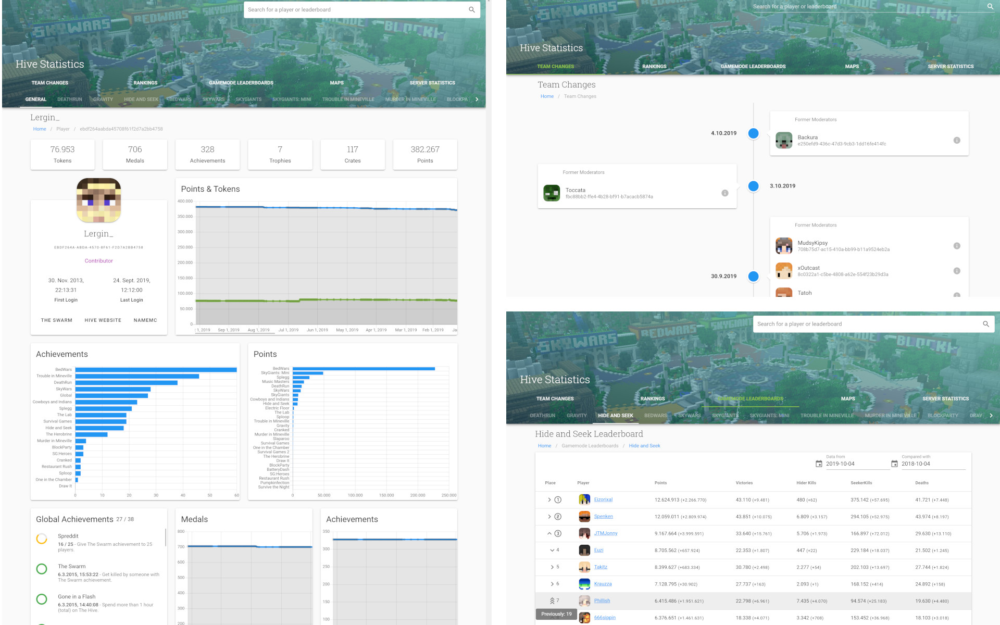

Hive Stats and Leaderboards is the most comprehensive website for statistics about The Hive. It provides rankings about who has the most [gold medals](https://hive.lergin.de/rankings/medals), [points](https://hive.lergin.de/rankings/points), [achievements](https://hive.lergin.de/rankings/achievements) and [many more](https://hive.lergin.de/rankings). We also track the points of players through the time for all the different gamemodes and provide more information than the The Hive profile page. Furthermore, we have [historic leaderboards](https://hive.lergin.de/leaderboards) for the different gamemodes and support comparing these. This website also has a [list of changes in the team of The Hive](https://hive.lergin.de/team) and a [list of all the maps](https://hive.lergin.de/maps). There are also statistics about the [unique players of the server and the gamemodes](https://hive.lergin.de/server).

<video controls>
  <source src="./hive-desktop.mp4" type="video/mp4" />

  
Video showing the different pages of the website

</video>

There is also a twitter bot that informs about team changes and new maps: @hivemc_updates

The Website can be found here: [https://hive.lergin.de/](https://hive.lergin.de/)

The Sourcecode is of the website is available here: [github.com/Lergin/hive-website](https://github.com/Lergin/hive-website)

The data collection is using my [Node.js Hive Api Library](https://forum.hivemc.com/threads/node-js-hive-api-library.279776/) and is also available on Github:  [github.com/Lergin/hive-datacollection](https://github.com/Lergin/hive-datacollection)
