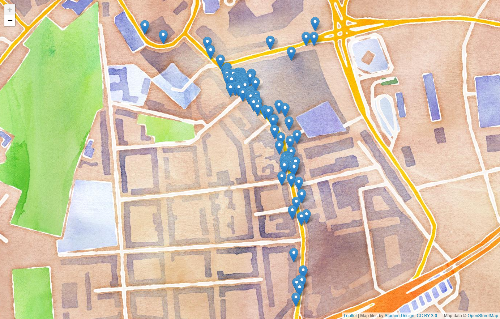
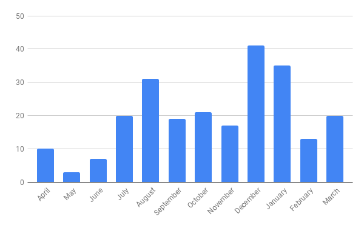

Bike lane parkers are a common occurrence in many big cities in Germany. One doesn't need to look for long to find images like these:

> Neulich meinte jemand, man könne ja gar nicht erkennen, dass diese attraktiven Streifen gar nicht zum Abstellen verkehrsgefährender Gegenstände während des Shopping-Trips gedacht sind. Da hab ich mal aufgemalt, wie man die Radwege in der Tamara-Danz-Straße erkennt #bvvxhain — Pascal Striebel 🌻 🚲 🏳️‍🌈 (@PascalStriebel) February 8, 2019

In Hamburg the Zentrale Bußgeldstelle (Central Fines Office) accepts reports from citizens that took images of these parked cars via email. A lot of other cities in Germany are doing the same, and there even exists [an unofficial app to simplify the creation of the email](https://medium.com/r/?url=https%3A%2F%2Fwww.wegeheld.org). As even this wasn't simple enough for me, I created a program that extracts almost all information directly from the image file, so it only takes me a few seconds to create such an mail. [¹](#1)

So after I found out about this and there hadn't been any effect through talking with the drivers, I decided at the beginning of April 2018 to take images and to send them to the email address provided by the Zentrale Bußgeldstelle. My first 8 reports where than directly in the street that would provide me with the most bike lane parkers, the Wilstorfer Straße directly in front of a big shopping center.

After some weeks I had the feeling that it has gotten a bit better in front of the shopping center, especially as some of the vans stocking a kiosk next to it stopped parking on the bike lane and instead used the street where they are legally allowed to stop and unpack.

But even this short success didn't really hold on and I did continue to create around 100 reports in this street alone.

The place directly in front of the kiosk can even be seen on this map as the place with the most markers. The parking at that place is especially bad for the bike traffic as it is directly above a curb cut leading the bike lane from next to the car lane next to the foodpath.

This street should turn out to be the street with the most reports I did file this year, but only as I travel it almost daily. The most reports for each ride through a street goes instead to the Ernst-Bergeest-Weg that I traveled only around 15 times this year, being blocked by illegal parked cars every time, so the street was still responsible for over 40 reports. A lot of the as the local residents seem to think the bike path is a good parking spot, even though there is a big parking lot around 100m down the street.

Another interesting graph is how many reports I filed each month in the last year, that quite nicely shows how I really started reporting in July, as before that I still had some yellow cards from the VCD that I clamped, with little effect, to the windshields of the not so bold parkers. As there hadn't been any change in my style of reporting between November and December and I was riding less kilometers as it was quite cold. Therefore it can be guessed that there is less respect to the bike lanes in the winter when less people are riding the bike, but to be sure one should look at the data after some more time to see if this trend is repeating.

The right one happened first and I informed the driver nicely with a yellow card that there are standing on a bike lane. The image on the left was then send to the Bußgeldstelle as the yellow card had apparently no effect. After that I didn't see them parking there again.
The most cars I have only seen do this once (87%) but there were also 8 cars which were already parked on the bike lane two times and one car is parked on a bike lane on my way to the university so often that I reported it already 13 times, without any changes in this behaviour.

To get to some idea of the scope of these reports, let's look at how many such reports were filed in Hamburg in the last years. 2016 there were 26 712 parking violations on bike lanes reported by 3rd parties (not the police or the LBV). These alone created a revenue of 573 324€ for the Free and Hanseatic City of Hamburg, so around 21,50€ for each reported offence. In the two years before this  amount was around 24,50€ so even higher and there were a total of 48 596 reports filed.[²](https://www.buergerschaft-hh.de/ParlDok/dokument/57145/halte-und-parkverst%C3%B6%C3%9Fe-%E2%80%93-anzeigen-durch-dritte.pdf)

If my reports are creating around the same amount of revenue these alone created approximately 5 000€ in fines and made up around 1% of all reports filed in Hamburg if there hadn't been a big spike in reports in 2018.

<video controls>
  <source src="./falschparker.mp4" type="video/mp4" />

  
Video showing the page used to report the persons parking in bike lanes

</video>

---

<a name="1">¹</a> The website is using the Google Auth and the Google Mail API and as such can only be used by the creator unless it is approved by Google, which requires some legal work that I don't plan to do. The source code, with some setup instructions, can be found on GitHub anyway: https://github.com/Lergin/Falschparker

<a name="2">²</a> https://www.buergerschaft-hh.de/ParlDok/dokument/57145/halte-und-parkverst%C3%B6%C3%9Fe-%E2%80%93-anzeigen-durch-dritte.pdf

---

**Read on Medium: https://medium.com/@lergin/one-year-of-reporting-bike-lane-parkers-10da2e6b6529**
