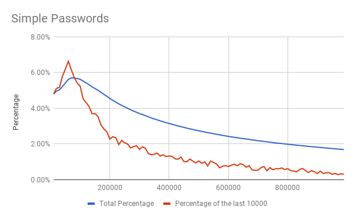
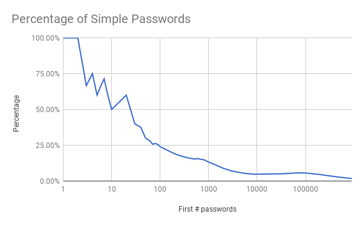
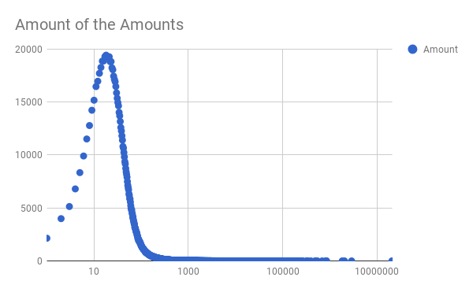
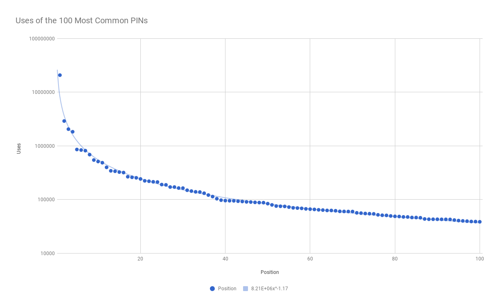
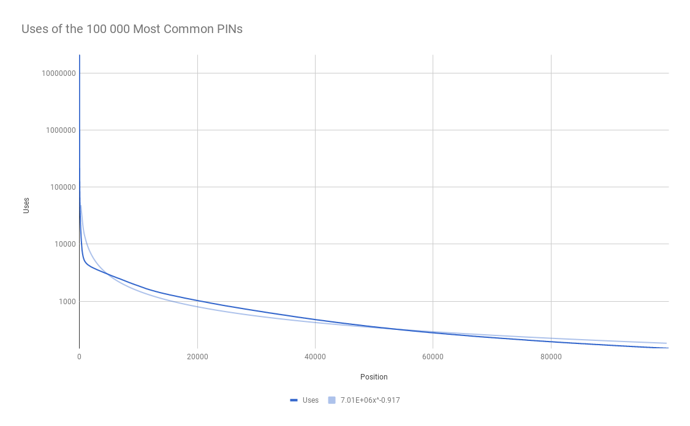

Last month Troy Hunt released Pwned Passwords V2, a list of 500 million hashed passwords together with how often these are used[¹](https://www.troyhunt.com/ive-just-launched-pwned-passwords-version-2/). I then analyzed these with respect to 6 digit PINs, that a lot of banks still use for the login to their online banking:

The first step was to get the hashes of all possible 6 digit PINs to extract these from the 500 million passwords, for this I had written a small node.js Script that was able to search through these in about 15 minutes and had found an entry for almost every possible PIN, this means that almost every PIN was already in a hack. Only 1707 of the 1 Million possible PINs hadn't been in the list:

> Only 1707 (0.1707%) 6 number passwords are *not* in pwned passwords 2 from @troyhunt And some banks still claim no one needs longer passwords... — Malte Laukötter | @malte@climatejustice.social (@Lergin_) March 2, 2018

I also did a small analysis of the most common PINs:

> The 3 most common 6 digit passwords are 123456 (13.46%), 111111 (1.88%) and 123123 (1.33%) so you should be able to break a lot of accounts even with only 3 tries — Malte Laukötter | @malte@climatejustice.social (@Lergin_) March 2, 2018

But to this, I think it is important to note that the list of passwords is almost exclusively from websites that allow more complicated passwords so these might differ when only 6 digit PINs are allowed. But I still think that this should be not too far of.

A lot of websites, such as the online banking of the Sparda-Bank Hamburg, only allow you 3 tries before they block the login to an account: But even when this is the case, you would still be able to get into 15% if there aren't any further security mechanisms!

Sparda-Banks comment after I had written an email to them about this:
> The guessing of a 6-digit PIN within 3 tries isn't a realistic scenario.

> Das eine 6-stellige PIN in drei Versuchen erraten wird, ist in der Praxis kein realistisches Szenario.

## Password Restrictions

Afterwards, I was also interested in how efficient the rules to block trivial PINs, that the Sparda-Bank is using, are to block the most common PINs. Therefore the Hamburgischen Beauftragten für Datenschutz und Informationsfreiheit (privacy officer of the city) has answered me with the following list of rules the Sparda-Bank is using:

> 1. Rows of numbers (growing and decreasing max. 3 numbers)
> 2. Numbers (max. 3 times the same number)
> 3. Test against the userid or parts of this
> 4. Test against the customerid or parts of this

> 1. Zahlenkolonnen (auf-/absteigend max. 3-stellig)
> 2. Zahlen (max. 3 gleiche Zahlen)
> 3. Prüfung gegen Benutzernummer oder Teile davon
> 4. Prüfung gegen Kundennummer oder Teile davon

As is already clear from reading these rules the 3. most common PIN (123123) is already allowed, I also tried to use it as PIN and it is working. I also tested 123498 that should be blocked but is working, so these aren't even implement in the way they claim they are and also are quite definitely not good enough but how useless are these:

Therefore I can of course only check the first 2 rules. But the 3. and 4. both should only block a handful of random numbers.

So I had written a small program to test the numbers against these rules and they would block 16655 different PINs or 23.16% of the used PINs so one could say that they at least are blocking a lot of common used Pins for only a small amount of blocked once (but also just allowing 123456 would lower this number to under 10%). Also of the 50 most common Pins, only 15 are blocked and even of the top 10 3 aren't blocked. If one would instead use Troy Hunt's list to block the most commonly 16655 PINs one would already block 56.23% of the uses and all PINs with over 1200 uses with the same restrictions on the user!

### Birthdays

Additionally, the BSI (German Federal Office for Information Security) is claiming in their password guidelines that birth dates shouldn't be used for passwords[²](https://www.bsi.bund.de/DE/Themen/ITGrundschutz/ITGrundschutzKataloge/Inhalt/_content/m/m02/m02011.html) so I also wanted to know how much this helps:

First of all, a birthdate would probably look like DDMMYY or MMDDYY so we would have about 31\*12\*100 = 37200 possible birth dates for each one of these.

29.63% of all used PINs are in the format DDMMYY and 20.66% have the format MMDDYY so for blocking 3.72% of possible PINs one can also remove a lot of commonly used PINs that are also easy to guess if the person is known as this information is simple to find via social media.

So I think it is a good idea to block birthdays but an even better to simply use a list of common used passwords or a combination of both. Also other password restrictions are helping but a list of commonly used passwords is still a lot better at blocking these.

## Charts

Other than that here a few charts created with the data:

---

**Read on Medium: https://medium.com/@lergin/6-digit-pins-c191ae4ae554**
