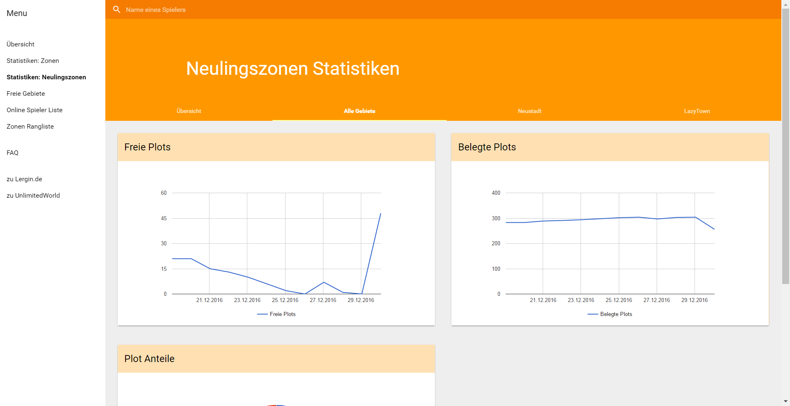

Einige von euch kennen sicherlich schon meine Statistiken über die Verteilung der Zonen auf der Karte (für die anderen: [https://unlimitedworld.de/showthread.php?6986-Wie-voll-ist-die-Map](https://unlimitedworld.de/showthread.php?6986-Wie-voll-ist-die-Map)) und nun hab ich hier noch einige weitere Tools:

## Spieler Informationen

Mithilfe dieses Tools, welches über diesen Link (offline) erreichbar ist, ist es möglich nach Spielern des Servers zu suchen indem man anfängt den Namen eines Spielers in der Suche eingibt und dann auf einen der vorgeschlagenen Namen klickt oder einern der Spieler auswählt der grade online ist. Daraufhin werden einem verschiedene Informationen über den Spieler angezeigt.

Zu den angezeigten Informationen gehören der Name, die UUID und der aktuelle Rang des Spielers auf dem Server. Es wird auch ein Link zum Forenaccount angezeigt, wenn der entsprechende Spieler einen besitzt. Außerdem gibt es eine Auflistung aller Rangänderungen des Spielers seit Mitte August, vorausgesetzt das Backend der Seite hat diese auch mitbekommen.

Außerdem wird eine Auflistung über die Anzahl an Votes des Spielers seit August 2016 angezeigt.

Desweiteren werden auch noch Informationen zu den Plots, Anfängerzonen und Zonen des Spielers angezeigt.

Zu den aktuellen und teilweise auch gelöschten Zonen wird die Größe, Position und die ZonenId angegeben. Auch das Erstell- und Löschdatum der Zone wird angezeigt, wobei der 09.08.2016 das frühestmögliche Datum ist.

Über Plots werden fast die selben Informationen wie über Zonen angezeigt, wobei hierbei auch noch angegeben wird wem der Plot gehört und wer alles Trusted-Rechte auf diesem hat und man durch einen Klick auf die dort angegebenen Namen auf die Seiten über die entsprechenden Person kommt. Auf der Seite eines Spielers werden alle Plots angezeigt, die dem Spieler gehören oder auf denen der Spieler Trusted-Rechte hat.

## Finder für frei Zonen

Dieses Tool gibt eine Liste aller sich nicht überschneidenden 100*100 Block großen Flächen der Hauptkarte aus:

## Zonen Rangliste

Desweiteren gibt es auf der Seite auch noch eine kleine "Rangliste" der Spieler mit den meisten und größten Zonen, welche bei jedem laden der Seite wieder mit den aktuellen Daten neu generiert wird (deswegen kann das laden auch durchaus über eine Minute dauern).

Diese Liste kann über den folgenden Link aufgerufen werden und sollte sowohl in der aktuellen Version von Chrome als auch Firefox generiert werden: offline

Die Liste kann natürlich, damit man nicht alle ca. 6000 Einträge durchscrollen muss um seine eigene Platzierung zu finden, auch nach Namen gefiltert werden, wodurch die angezeigten Einträge direkt (bzw. bei den ersten 2 Buchstaben aufgrund der großen Anzahl an Einträgen erst nach einigen Sekunden) auf diejenigen beschränkt wird, die auf den Namen passen.

Angezeigt werden die Listen für die meisten Zonen pro Spieler, die meiste gezonte Fläche pro Spieler und die größten Zonen.
## Welt Statistiken

## Neulingszonen Statistiken

## Webapp

Die Seite selbst ist eine Webapp was bedeutet, dass diese einige Funktionen einer normalen App bietet und der Browser auf einem Smartphone einem dementsprechend nach einiger Zeit der Benutzung fragt, ob man die Webapp zu einem Homescreen hinzufügen möchte. Durch das hinzufügen zu einem der Homescreens kann die Seite dann durch einen klick auf das Icon geöffnet werden und wird ohne das übliche BrowserUI angezeigt. Außerdem kann diese Webapp wie weiter unten noch erklärt wird Benachrichtigungen verschicken.

Natürlich funktioniert die ganze Seite auch nach dem erstmaligen öffnen ohne eine Internetverbindung, wobei dann allerdings nur bereits angesehene Daten angezeigt werden.

## Benachrichtigungen

Die Seite bietet außerdem die Möglichkeit Benachrichtigungen zu abonnieren und somit Benachrichtigt zu werden, wenn es eine Regeländerung gibt, ein Spieler online kommt oder offline geht und sobald ein Spieler eine Rangänderung hat:

Die Benachrichtigungen über Spieler können auf den entsprechenden Spieler Seiten in der Übersicht aktiviert werden:

Die Regeländerungsbenachrichtigungen können auf der Benachrichtigungsseite, auf welcher auch alle aktuell abonnierten Benachrichtigungen angezeigt werden und deabonniert werden können, abonniert werden.

Achja ansonsten werden die Benachrichtigungen nur angezeigt wenn die Seite grade nicht im Vordergrund ist.

## Quellcode

Der Sourcecode der Seite ist auf Github zu finden ([https://github.com/Lergin/uwmctools](https://github.com/Lergin/uwmctools)) und kann mithilfe von npm und dem Befehl npm install uwmctools --save installiert werden, für eine genaue Anleitung zur Verwendung des Packages kann ich nur empfehlen die Readme Datei zu lesen: [https://www.npmjs.com/package/uwmctools](https://www.npmjs.com/package/uwmctools) Für genauere Informationen über die Funktionalitäten der einzelnen Klassen empfiehlt es sich die Kommentare inerhalb des Quellcodes anzusehen.